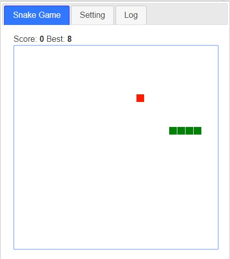

<h1 align="center">Simple Snake Game</h1>

<p align="center">
  The classic Snake game as a lightweight, offline, Manifest&nbsp;V3 Chrome extension -
  always one click away.
</p>

<p align="center">
  <a href="https://github.com/doctorlai/snakegame/actions/workflows/ci.yml"></a>
  <a href="https://codecov.io/gh/doctorlai/snakegame"></a>
  <a href="LICENSE"></a>
  <a href="https://nodejs.org"></a>
  <a href="snake/manifest.json"></a>
  <a href="package.json"></a>
</p>

<p align="center">
  <a href="https://chromewebstore.google.com/detail/simple-snake-game/fbbeckekbefhhmabpfjgpjobkmnfjbec"></a>
  <a href="https://chromewebstore.google.com/detail/simple-snake-game/fbbeckekbefhhmabpfjgpjobkmnfjbec"></a>
  <a href="https://chromewebstore.google.com/detail/simple-snake-game/fbbeckekbefhhmabpfjgpjobkmnfjbec"></a>
  <a href="https://github.com/doctorlai/snakegame/issues"></a>
  <a href="https://github.com/doctorlai/snakegame/stargazers"></a>
  <a href="https://github.com/doctorlai/snakegame/network/members"></a>
  
  
  <a href="CONTRIBUTING.md"></a>
</p>

<p align="center">
  
</p>

## Features

- **Classic Snake gameplay** rendered on an HTML5 canvas.
- **Keyboard and touch controls**: arrows, WASD, and swipe gestures on touch screens.
- **Pause / resume** with the space bar.
- **Game Over screen** showing your score, with press-any-key (or tap) to restart.
- **Selectable speed**: Slow, Normal, Fast, or Auto (speeds up as you grow).
- **Wall mode toggle**: die on the walls or pass through them.
- **Best-score tracking** synced across devices via `chrome.storage.sync`.
- **Fair apple spawns** that never appear underneath the snake.
- **13 languages** out of the box (see [Internationalization](#internationalization)).
- **Fully offline** and dependency-free at runtime: no tracking, no network calls.

## Controls

| Action                    | Keyboard           | Touch       |
| ------------------------- | ------------------ | ----------- |
| Move up                   | `ArrowUp` / `W`    | Swipe up    |
| Move down                 | `ArrowDown` / `S`  | Swipe down  |
| Move left                 | `ArrowLeft` / `A`  | Swipe left  |
| Move right                | `ArrowRight` / `D` | Swipe right |
| Pause / resume            | `Space`            | -           |
| Restart (after Game Over) | Any key            | Tap         |

## Play

- **Chrome Web Store:** <https://chromewebstore.google.com/detail/simple-snake-game/fbbeckekbefhhmabpfjgpjobkmnfjbec>
- **Play in the browser:** <https://helloacm.com/static/game/snake/>

### Install from source (developer mode)

1. Clone this repository (see below).
2. Open `chrome://extensions` in Chrome.
3. Enable **Developer mode** (top-right).
4. Click **Load unpacked** and select the [`snake/`](snake) folder.
5. Open the popup and play.

## Development

```bash
git clone https://github.com/doctorlai/snakegame.git
cd snakegame
npm install
```

| Task                   | Command                |
| ---------------------- | ---------------------- |
| Run all CI checks      | `npm run check`        |
| Run the test suite     | `npm test`             |
| Watch mode             | `npm run test:watch`   |
| Coverage report        | `npm run coverage`     |
| Lint                   | `npm run lint`         |
| Auto-fix lint          | `npm run lint:fix`     |
| Format files           | `npm run format`       |
| Check formatting only  | `npm run format:check` |
| Build the store `.zip` | `npm run build`        |
| Check, then build      | `npm run release`      |

All game logic lives in the pure, framework-free [`snake/js/engine.js`](snake/js/engine.js)
module, which is what makes it easy to unit-test. The browser-facing code in
[`snake/js/game.js`](snake/js/game.js) is a thin adapter that wires the engine to
the DOM, canvas and keyboard.

## Building for the Chrome Web Store

Produce an upload-ready archive with:

```bash
npm run build
```

This writes `dist/simple-snake-game-v<version>.zip` (the version is read from
[`snake/manifest.json`](snake/manifest.json)). The archive contains the contents
of [`snake/`](snake) with `manifest.json` at its root, which is exactly what the
[Chrome Web Store Developer Dashboard](https://chrome.google.com/webstore/devconsole)
expects. Use `npm run release` to run the full check suite before packaging.

## Quality checks

The engine is covered by a [Jest](https://jestjs.io/) test suite under
[`tests/`](tests). Coverage thresholds, ESLint, and Prettier formatting are
enforced locally and in CI:

```bash
npm run check
```

Continuous integration runs the full check command on Node 18, 20 and 22 for
every push and pull request via [GitHub Actions](.github/workflows/ci.yml).

## Project structure

```
snakegame/
├── snake/                 # The Chrome extension
│   ├── manifest.json      # Manifest V3 definition
│   ├── main.html          # Popup UI
│   ├── js/
│   │   ├── engine.js      # Pure, unit-tested game logic
│   │   ├── game.js        # DOM/Canvas adapter
│   │   ├── main.js        # Settings + initialization
│   │   ├── translate.js   # i18n helpers
│   │   └── background.js  # Service worker
│   ├── lang/              # UI translations (13 languages)
│   ├── _locales/          # Chrome store locale metadata
│   ├── css/ / bs/         # Styles and Bootstrap
│   └── images/
├── tests/                 # Jest unit tests
├── scripts/               # Build tooling (store .zip packaging)
├── .github/workflows/     # CI pipeline
└── package.json
```

## Internationalization

The UI is available in **13 languages**: English, Simplified Chinese,
Traditional Chinese, French, Dutch, Spanish, Italian, Russian, German, Romanian,
Polish, Portuguese (BR), and Turkish.

Translations live in [`snake/lang/`](snake/lang), and contributions for new
languages are very welcome.

## Ideas and roadmap

Want to help? These are great ways to contribute:

- Optional sound effects with a mute setting.
- Selectable color themes.
- Obstacles and difficulty levels.
- Keyboard shortcut hints inside the settings tab.
- Additional UI translations and Chrome Web Store locale metadata.

Open an issue to discuss an idea before sending a larger pull request.

## Contributing

Contributions are welcome! Please read [CONTRIBUTING.md](CONTRIBUTING.md) and use
the issue templates under [`.github/ISSUE_TEMPLATE`](.github/ISSUE_TEMPLATE).

## Support

If you enjoy the game, consider supporting development and maintenance:

- [Buy me a coffee](https://helloacm.com/out/buymecoffee)

Many thanks!

## License

Released under the [MIT License](LICENSE).
